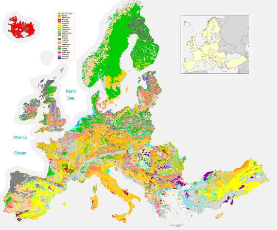

class: center, middle

# Pedogenesis

### Pedogenesis is the process of soil creation from parent bedrock

---

# The 3 steps of [pedogenesis](https://planet-terre.ens-lyon.fr/ressource/formation-sols-climat-tempere.xml)

<table>
    <colgroup>
       <col span="1" style="width: 33%;">
       <col span="1" style="width: 33%;">
       <col span="1" style="width: 33%;">
    </colgroup>
  <tr>
    <th> 1. Weathering</th>
    <th> 2. Enrichment </th>
    <th> 3. Horizonation </th>
  </tr>
  <tr>
    <td> Degradation of parent materials</td>
    <td> Addition of organic matter (required to be defined as soil) </td>
    <td> Vertical differentiation of horizons (from top to bottom) </td>
  </tr>
  <tr>
    <th> </img> </th>
    <th> </img> </th>
    <th> </img> </th>
  </tr>
</table>

.footnote[
[Source] [Dossier INRA "Le sol", Janvier 2009](https://belinra.inrae.fr/index.php?lvl=notice_display&id=20700)
]

---

background-image: url(fig/soil/microped.jpg)
background-size: cover
class: center, bottom, inverse

# Two layers of pedogenesis 
### Secondary pedogenesis on a rocky scree

---
# Factors influencing pedogenesis
 
- There are **5 main factors** influencing the process of soil creation:
     - Climate (Cl)
     - Organisms (O)
     - Relief (R)
     - Parent material (P)
     - Time (T)
     
- This may be remembered as 'ClORPT' (Hans Jenny, 1941)
     
       $$ Soil=f(Cl,O,R,P,T)$$

- The combination of these different factors gives a multitude of soils.
---

# Climate
 
- T° and H2O influence how fast rocks weather: soils develop faster in warm, moist climates and slowest in cold or arid ones.

</img>

.footnote[[Latitudinal gradient in soil structure and weathering depth in relation to climate and vegetation (Huston & Wolverton, 2009)](https://www.montana.edu/hansenlab/documents/bio494/hustonWolverton2009.pdf)
]
---
# Organisms
.pull-left[
- Living organisms accelerate the weathering of the bedrock, through physical (root penetration...) or chemical (exsudate...) degradation

- They stabilize the soil and limit erosion
]
.pull-right[
  
]
--

- **Mineral particles resulting from the alteration of parental bedrocks need to be enriched in organic matter to define a soil**

---

# Organisms

- Soil organic matter is an important carbon pool (~twice bigger that the atmospheric pool)
> The fate of [soil carbon can have a strong influence on climate change](https://www.4p1000.org/), depending on whether carbon is stored or mineralized

.pull-left[
- Soil organic carbon is stabilized by the interaction with mineral particles (clay, limestone...)
]
.pull-right[
- Soil organic carbon is mineralized by the respiration of aerobic organisms...
]

- But there are still many things to discover about [the nature of soil organic carbon](https://www.quantamagazine.org/a-soil-science-revolution-upends-plans-to-fight-climate-change-20210727/)

---

background-image: url(fig/soil/slope.jpg)
background-size: cover
class: center, bottom, inverse

# Relief 
### Soil creation of soil only occurs if  alteration > erosion

---

# Relief
 
- Soils are generally shallow on slopes due to erosion...

- ...whereas deeper soils form at the bottom of a hill because gravity and water move soil particles down the slope.

</img>

.footnote[ [(a) Slope and (b) soil depth maps (Tagarakis et al. 2018) ](https://link.springer.com/article/10.1007/s11119-017-9519-4)
]

---

# Parent materials

- At the Earth's surface, all rocks are subject to alteration

- Soils inherits traits from the parent material from which they formed
  - For example, soils that form from limestone are rich in calcium, with high pH, while soils evolving from granite have low pH

- As they evolve, soils can drift away from these inherited characteristics
  
- The two main types of parent materials are:
  - Magmatic rocks
  - Sedimentary rocks

---

# Parent materials 

<table>
    <colgroup>
       <col span="1" style="width: 50%;">
       <col span="1" style="width: 50%;">
    </colgroup>
  <tr>
    <th colspan="2"> Magmatic rocks </th>
  </tr>
  <tr>
    <th> Eruptive rocks </th>
    <th> Plutonic rocks </th>
  </tr>
  <tr>
    <td> Rock resulting from a surface solidification of the lava </td>
    <td> Rocks that solidified from a melt at great depth </td>
  </tr>
  <tr>
    <td> Example: Basalt </td>
    <td> Example: Granite </td>
  </tr>
  <tr>
    <th> </img> </th>
    <th> </img> </th>
  </tr>
</table>

---

# Parent materials 

<table>
    <colgroup>
       <col span="1" style="width: 50%;">
       <col span="1" style="width: 50%;">
    </colgroup>
  <tr>
    <th colspan="2"> Sedimentary rocks </th>
  </tr>
  <tr>
    <td colspan="2"> Formation at the surface of the earth or oceanic crust by : (i) Erosion, transport then sedimentation (detrital sedimentary rocks) OR (ii) Accumulations or precipitations of biological or physico-chemical origin in the oceans (limestones...) </td>
  </tr>
  <tr>
    <th> Silicates (Mostly SiO2) </td>
    <th> Carbonates (Mostly CaCO3) </td>
  </tr>
  <tr>
    <td> Example: Basalt </td>
    <td> Example: Limestone </td>
  </tr>
  <tr>
    <th> </img> </th>
    <th> </img> </th>
  </tr>
</table>

---

# Time
- The process of pedogenesis is slow and the creation of a soil takes several tens to hundreds of thousands of years.  

> But if soils seem stable on a human scale, they are in **constant evolution on a geological scale**. 

- The following presentation will present **one example of a chronosequence**

- This example will present one possible evolution of a limestone bedrock

---

class: center, middle

# An example of soil chronosequence

### A sequence of related soils that differ in their degree of profile development because of differences in their age.

---

# Soil denominations

.pull-left[
  </img>
]

.pull-right[
- The names of the soils used in the rest  of the presentation come from the [French pedological reference system](https://horizon.documentation.ird.fr/exl-doc/pleins_textes/divers15-05/010063397.pdf)

- This reference system describes the characteristics of soil horizons and soil types 

]

---

# Rendosol

.pull-left[
  **General profile for** **a 'very young' soil** 
  </img>
]

.pull-right[
  **Specific profile for a rendosol** 
  **Aca** Horizon A with limestone
  </img> 
  **Horizon C** Limestone bedrock
]

.footnote[ 

[Picture: jymassenet-foret.fr](http://jymassenet-foret.fr/cours/pedologie/chapitre6-2006.pdf)

]

---

# Clay formation

- Weathering of bedrock minerals, such as [feldspar](https://geology.com/minerals/feldspar.shtml), produces clay
> As minerals, **clays are phyllosilicates**, characterized by alternating layers of silica (tetrahedral sheet) and aluminum (octahedral sheet)

.center[
</img>
]

- Si sheets are negatively charged and can thus 'store' cations (K+, Na+...) or H2O (because of its polarity) 

---

# Clay formation

- Soils are differentiated according to their Si:Al ratio

- Due to the retention capacity of the silica sheets, the higher the ratio, the higher the storage capacity of the soil

.center[
</img>
]
- 2:1 clays are more likely to be [expansive](https://coloradogeologicalsurvey.org/hazards/expansive-soil-rock/)

---

# Calcisol

.pull-left[
  **General profile for** **a 'young' soil** 
  </img>
]

.pull-right[
  **Specific profile for a calcisol** 
  **Sca** Horizon S with limestone
  </img>

]

.footnote[ 

[Picture: jymassenet-foret.fr](http://jymassenet-foret.fr/cours/pedologie/chapitre6-2006.pdf)

]

---

# Decarbonation

 

$$CaCO_{3} + CO_{2} + H_{2}O ⇄ 2HCO_{3}^{-} + Ca_{2}^{+}$$
 
- [Rainwaters absorb atmospheric CO2](https://planet-terre.ens-lyon.fr/ressource/co2-et-carbonates.xml), and these rainfalls erodes limestone, which is then transformed into HCO3- and Ca2+.

- The residual solution is leached out at depth

- So the horizons will be decarbonated **from top to bottom**

---

# Brunisol

.pull-left[
  **General profile for** **a 'mid-aged' soil** 
  </img>
]

.pull-right[
  **Specific profile for a brunisol** 
  Horizon S **without** limestone
  </img>

]

.footnote[ 

[Picture: jymassenet-foret.fr](http://jymassenet-foret.fr/cours/pedologie/chapitre6-2006.pdf)

]

---

# First part of the chronosequence

</img>

---

# Luvisol

.pull-left[
  **General profile for** **an old soil** 
  </img>
]

.pull-right[
  **Specific profile for a luvisol** 
  **Clay leaching** from **E** to **B(t)** 
  </img>

]

.footnote[ 

[Picture: Rossignol (2013)](https://www.snhf.org/wp-content/uploads/2018/01/JPRossignol-pedogenese.pdf)

]

---

# Water dynamics

- A **B horizon** enriched in clay is called **Bt**

- Bt horizon induce water accumulation, which will intereact with Fe through redox reactions (electron exchanges with oxygen)
.pull-left[
  *Pseudogley with oxidation traces: markers of temporary flooding (O2 after flooding)* 
  </img>
]
.pull-right[
  *Gley with reduction traces: markers of permanent flooding (no O2)* 
  </img>
]

---

# Luvisol redoxic

.pull-left[
  **General profile for** **an old soil** 
  </img>
]

.pull-right[
  **Profile for a redox luvisol** 
  Temporary flooding in B(tg) 
  </img>

]

.footnote[ 

[Picture: Rossignol (2013)](https://www.snhf.org/wp-content/uploads/2018/01/JPRossignol-pedogenese.pdf)

]

---

# Reductisol

.pull-left[
  **Soil with permanent flooding** 
  </img>
]

.pull-right[
  **Profile for a reductisol** 
  Characteristic 'blue' color of G 
  </img>

]

.footnote[ 

[Picture: Legros (2010)](http://www.forum-zones-humides.org/iso_album/atelier-id-zh-pedologie.pdf)

]

---

# Continuation of chronosequence
.center[
</img>
]
---

# Soil evolutions

- Given examples represent only few possibilities of soil evolution, there are a large number of alternatives

.center[
  </img>
]

.footnote[ 

[Source: Alain Ruellan]

]

---

class: center, middle

# Soil maps

### Examples of available references

---

# French soil map

.pull-left[
  </img>
]

.pull-right[
- Regional soil reference system: soil-landscape Map at 1:250,000 scale

- Available at [Géoportail](https://www.geoportail.gouv.fr/)
]

---

# European soil map

.center[
  </img>
]

.footnote[ 

[Source: [Soil Atlas of Europe](https://esdac.jrc.ec.europa.eu/content/soil-atlas-europe)]

]

---
